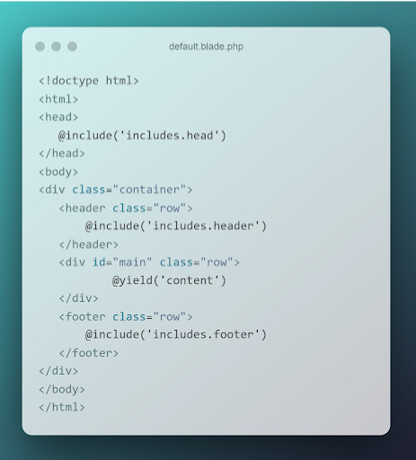
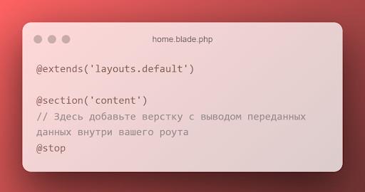
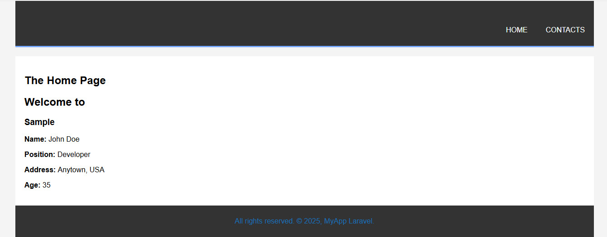
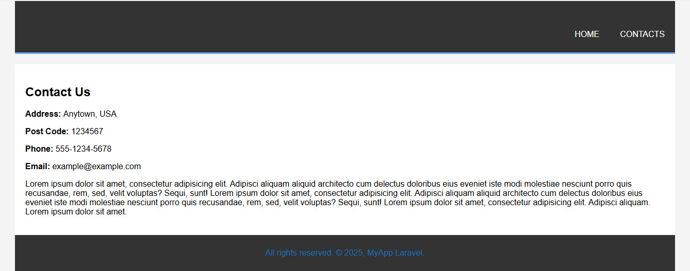
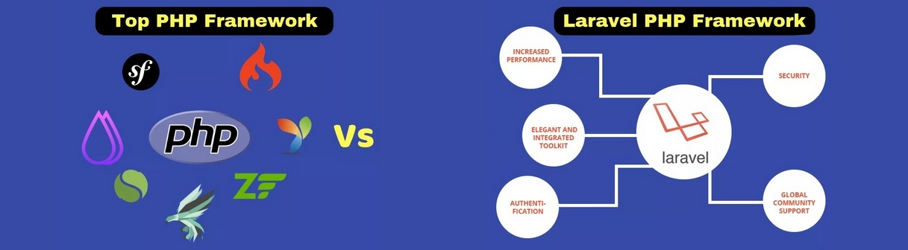

# Продвинутое программирование на PHP - Laravel
## Урок 4. Работа с шаблонами. Шаблонизатор Blade
### Домашнее задание
<br><br>
#### Цели практической работы:<br>

#### Научиться:<br>

• создавать шаблоны blade и переиспользовать их;<br>
• применять вложенные шаблоны на практике;<br>
• передавать динамические данные на страницу;<br>
• использовать директивы.<br>


#### Что нужно сделать:<br>

1. Создайте новый проект Laravel или откройте уже существующий проект, в который хотите добавить шаблоны.

2. Создайте новую ветку вашего репозитория от корневой (main или master).

3. В корневом каталоге проекта создайте подкаталог resources/views. Создайте в нём два шаблона: home.blade.php и contacts.blade.php. Вы заполните эти шаблоны позже.

4. В файле routes/web.php создайте необходимые роуты для навигации по страницам и передачи данных:

- Первый роут - '/', ссылается на корневую страницу проекта. Route::get должен возвращать функцию view. Первым аргументом передайте шаблон home, вторым аргументом - массив данных с ключами name, age, position, address. Значения могут быть произвольными. <br>

- Второй роут - '/contacts', ссылается на одноимённую страницу с контактами. По аналогии с первым роутом верните из роута функцию view, передайте шаблон contacts и массив с данными - address, post_code, email, phone. <br>

5. В директории views создайте подкаталог layouts, внутри которого поместите шаблон default.blade.php:<br>

```
<!doctype html>
<html>
   <head>
             @include('includes.head')
   </head>
    <body>
        <divclass="container">
            <header class="row">
                @include('includes.header')
            </header>
            <div id="main" class="row">
                @yield('content')
            </div>
            <footer class="row">
                @include('includes.foote')
            </footer>
        </div>
    </body>
</html>


```
6. Как видно из картинки выше, вам необходимо создать переиспользуемые шаблоны для тегов ```<head>```, ```<footer>``` и ```<hеader>```. Для этого в папке views создайте подкаталог includes, а в ней, по аналогии уже с созданными страницами: <br>
  три соответствующих шаблона с произвольной вёрсткой и вложенностью.

7. Вернёмся к страницам home и contacts:<br>

```
@extends('layouts.default')
@section('content')
// Здесь добавить верстку с выводом переменных данных внутри роутера
@stop
```
8. Внутри директивы @section добавьте базовую HTML-разметку. Для каждой страницы воспользуйтесь директивой @if. Если значение age для страницы home больше 18 лет, выводите простую цифру, в противном случае - предупреждающее сообщение о том, что указанный человек слишком молод. То же самое повторите и со страницей контактов.
   Если вместо почты в шаблон приходит пустая строка, выведите сообщение:
   «Адрес электронной почты не указан».

9. Сделайте коммит изменений с помощью Git и отправьте push в репозиторий.

<br><br>

### Домашнее задание
<br><br>

1. composer create-project laravel/laravel php-blade
2. cd php-blade
3. php artisan serve
4. Подключаем репозиторий:

```
git init
git add .
git commit -m "first commit"
git branch -M main
git remote add origin https://github.com/stanislavfor/php-blade.git
git push -u origin main

```
5. Записываем содержимое web.php, например:
```
<?php

use Illuminate\Support\Facades\Route;

Route::get('/', function () {
    return view('home', [
        'name' => 'John Doe',
        'age' => 35,
        'position' => 'Developer',
        'address' => 'Anytown, USA'
    ]);
});

Route::get('/contacts', function () {
    return view('contacts', [
        'address' => 'Anytown, USA',
        'post_code' => '1234567',
        'email' => 'example@example.com',
        'phone' => '555-1234-5678'
    ]);
});


``` 

6. Добавляем содержимое для файлов (по заданию):
- resources/views/layouts/default.blade.php
- resources/views/includes/head.blade.php
- resources/views/includes/header.blade.php
- resources/views/includes/footer.blade.php
- resources/views/home.blade.php
- resources/views/contacts.blade.php

7. В проект возможно подключить стили в CSS файле. <br>
   Файл styles.css размещаем в папке public/css. <br>
   В файле resources/views/includes/head.blade.php для этого вписываем строку для подключения CSS файла, то есть размещаем подключение стилей в head страницы сайта:
```
<link rel="stylesheet" href="{{ asset('css/styles.css') }}">
```
Проверяем загруженные стили, в браузере ```http://localhost:8000/css/styles.css```
8. Повторно открываем страницы проекта:
- страница home

- страница contacts



<br><br><br>


**Советы и рекомендации:**<br>

- При проектировании шаблонов думайте о том, какие участки разметки можно будет переиспользовать позже, вынести в отдельные файлы и компоненты.

<hr>
**В качестве решения приложить:** <br>
➔ ссылку на репозиторий с домашним заданием <br>
⚹ записать необходимые пояснения к выполненному заданию<hr><br>
**Критерии оценки:**<br>

**Принято:**<br>
• выполнены все пункты задания;<br>
• в работе используются указанные инструменты и соблюдены условия;<br>
• код корректно отформатирован по стандартам программирования на PHP;<br>
• скрипт запускается, выводит различные данные на экран, не вызывает ошибок.<br>

**На доработку:**<br>
• выполнены не все обязательные пункты задания;<br>
• задание выполнено с ошибками.<br>

**Как отправить работу на проверку:**<br>

Отправьте коммит, содержащий код задания, на ветку master в вашем репозитории и пришлите его URL (URL Merge Request’а) через форму. Репозиторий должен быть public.<br>
<br><br><br>


[README-LARAVEL.md](README-LARAVEL.md)

<br><br><br>
